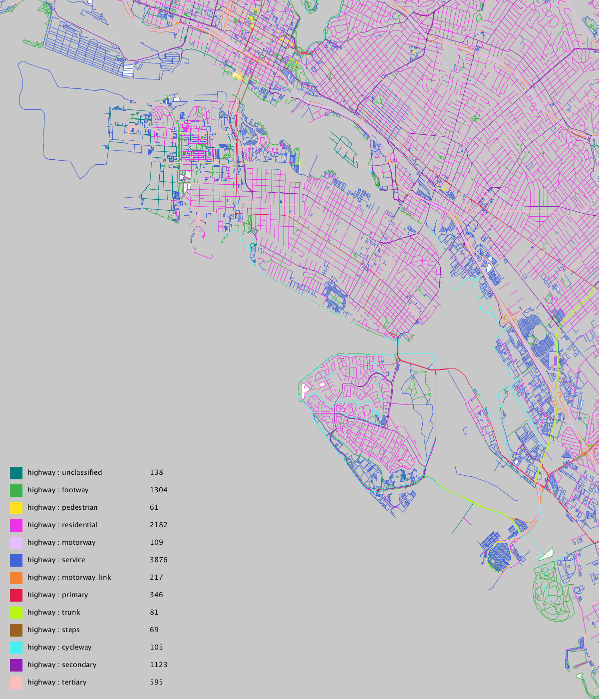

# Alameda Map

The purpose of this project is to:

- Refresh Processing knowlege
- Better understand how OpenStreetMap is organized
- Create some interesting maps

I'll be documenting my progress as I go with simple output:

### Map 01: Initial Mapping

### Map 02: Isolating Tag Types: Roads

